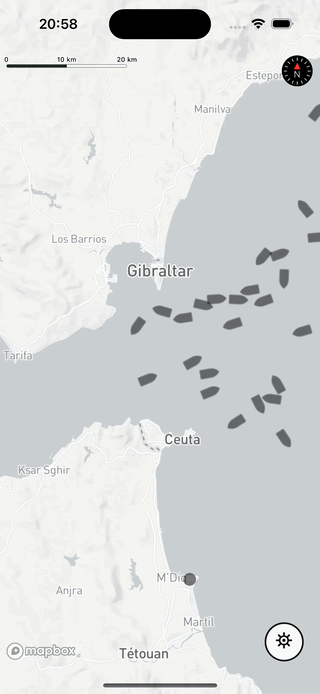

# AIS Viewer Realtime

End-to-end project to ingest realtime AIS vessel positions to a custom backend and visualize it in a performant React Native map

 

## What is AIS?

> The automatic identification system, or AIS, transmits a ship’s position so that other ships are aware of its position. The International Maritime Organization and other management bodies require large ships, including many commercial fishing vessels, to broadcast their position with AIS in order to avoid collisions. Each year, more than 400,000 AIS devices broadcast vessel location, identity, course, and speed information. Ground stations and satellites pick up this information, making vessels trackable even in the most remote areas of the ocean.[1]

## Tech Stack

- **Frontend:** React Native, Typescript, Mapbox, zod (data validation)
- **Backend:** Docker, Fastify, Typescript, PostgreSQL + PostGIS extension, DrizzleORM, zod (data validation)

> [!NOTE]
> This tech stack was chosen for its proven performance, developer-friendly experience (DX), code robustness, modularity, and unified TypeScript language codebase. All technologies used are modern, actively maintained, and popular within their domains.

## Project Goals

### Backend

- **Ingests realtime global AIS vessel data** to PostGIS using websockets connected to aisstream.io[2]
- Exposes `GET /api/vessels` REST endpoint from Fastify to **filter recently updated vessels** (2 minutes max) **in a map bounding box**
- **Dockerized backend deployment** to allow one-command setup and keep data volume even after backend reboot or redeploy

### Frontend

- **Optimized Mapbox map visualizes AIS vessels data** (could be more than 30k vessels for full-world coverage)
  - Fetches the API REST endpoint with a polling mechanism in the visible map bounding box
  - Renders a GPU-native Mapbox Layer[3] to display vessels as GeoJSON data source
  - Vessels with heading available are displayed with a vessel icon correctly oriented and those with no heading available aka. value 511 [4], are displayed with a circle icon
- **Allows to configure simple settings** like the minimum zoom level to fetch vessels on the map and the fetch polling interval

### Both

- Clean, production-ready TypeScript **for safer code and easier maintenance**
- Uses zod for **consistent data validation when communicating with external sources** (AIS stream, REST API, etc.)
- Separation of concerns: **clear module and folder structure**
- **Automated linting and formatting** via biome.json for unified code style and prevention of common errors
- **Read environment variables** to manage specific sensitive credentials

## Quick Start

### Backend

> [!TIP]
> Skip the backend setup using our domain [aisviewer.dev](https://aisviewer.dev)

1. Install dependencies:

```bash
cd backend && npm install
```

2. Create a `backend/.env` file like the template:

```bash
POSTGRES_USER=postgres
POSTGRES_PASSWORD=postgres
POSTGRES_DB=postgres
AIS_API_KEY=ais-api-key
```

Default `postgres` is also secure because the DB is not exposed on the port 5432. Get the `AIS_API_KEY` from [aisstream.io](https://aisstream.io) connected to your GitHub account

3. Run Docker compose building the current Dockerfile:

```bash
docker compose up --build
```

4. If everything worked successfully you should see in the logs:

```bash
api-1   | [AIS Ingest] (2025-06-05T17:37:25.235Z) - WebSocket connected and subscription sent
api-1   | [AIS Ingest] (2025-06-05T17:37:25.967Z) -  Vessels per second: 245
api-1   | [AIS Ingest] (2025-06-05T17:37:26.969Z) -  Vessels per second: 251
api-1   | [AIS Ingest] (2025-06-05T17:37:27.971Z) -  Vessels per second: 304
api-1   | [AIS Ingest] (2025-06-05T17:37:28.971Z) -  Vessels per second: 265
```

These logs mean that all this amount of data is being ingested to our PostGIS DB, in a few minutes there will be +25k AIS data points.

4. Fetch in your browser the `GET /api/vessels` REST endpoint from [localhost:3000](http://localhost:3000/api/vessels?south=39.58650236726501&west=2.657854330120216&north=39.5301225757774&east=2.6241228698792725) or use our domain [aisviewer.dev](https://aisviewer.dev/api/vessels?south=39.58650236726501&west=2.657854330120216&north=39.5301225757774&east=2.6241228698792725)

### REST API Documentation

`GET /api/vessels`

Returns a list of vessels updated in the last 2 minutes and currently within the specified bounding box.

_Query parameters:_

- `south` (number, required) – Minimum latitude of the bounding box.
- `west` (number, required) – Minimum longitude of the bounding box.
- `north` (number, required) – Maximum latitude of the bounding box.
- `east` (number, required) – Maximum longitude of the bounding box.

_Example request:_

```bash
GET /api/vessels?south=39.5865&west=2.6578&north=39.5301&east=2.6241
```

_Response:_

```json
[
  {
    "mmsi": 244690035,
    "position": [2.628615, 39.562443],
    "heading": 511,
    "updated_at": "2025-06-05T17:58:26.425Z"
  },
  ...
]
```

_Notes:_

- Only vessels updated within the last 2 minutes are returned
- The response format is a JSON array of vessel objects
- Heading is equal to 511 for vessels with no heading available

### Frontend

> [!IMPORTANT]
> To run this React Native CLI project it requires [prior configuration](https://reactnative.dev/docs/getting-started-without-a-framework).

1. Install dependencies:

```bash
cd frontend/mobile/AISViewer && npm install
```

2. Create a `frontend/mobile/AISViewer/.env` file like the template:

```bash
MAPBOX_API_KEY=mapbox-api-key
```

Get the `MAPBOX_API_KEY` from [mapbox.com](https://www.mapbox.com/)

3. Run the app:

```bash
cd ios && pod install && cd ..
npm run ios
# or
npm run android
```

## References

- [1] https://globalfishingwatch.org/faqs/what-is-ais
- [2] https://aisstream.io/documentation
- [3] https://docs.mapbox.com/help/troubleshooting/markers-vs-layers/
- [4] https://emsa.europa.eu/cise-documentation/cise-data-model-1.5.3/model/guidelines/687507181.html
